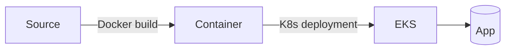

# Architecture Overview

- Python Flask app in `src/`
- Docker image built from `docker/Dockerfile`
- Kubernetes manifests in `k8s/` (Deployment, Service, HPA)
- EKS cluster managed in `iac/`
- Jenkins pipeline in `jenkins/Jenkinsfile`

